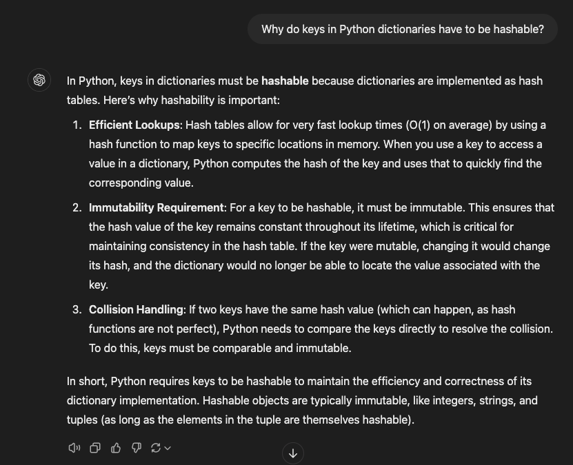
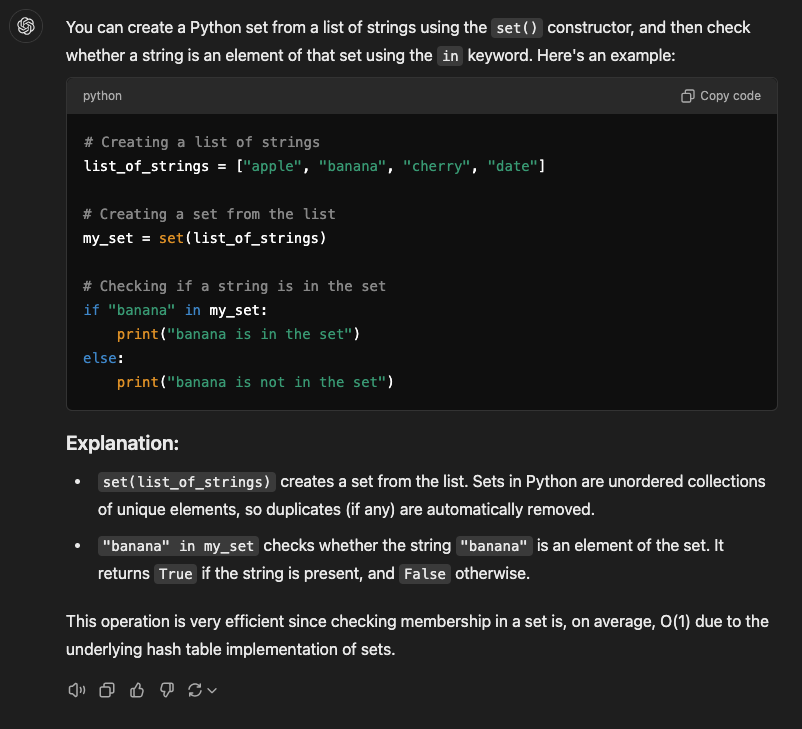

# Exercise 01 - Ask a Virtual Assistant

* Why do keys in Python dictionaries have to be hashable?

* How do I make a Python set from a list of strings and check whether a string is an element of the set?
  
